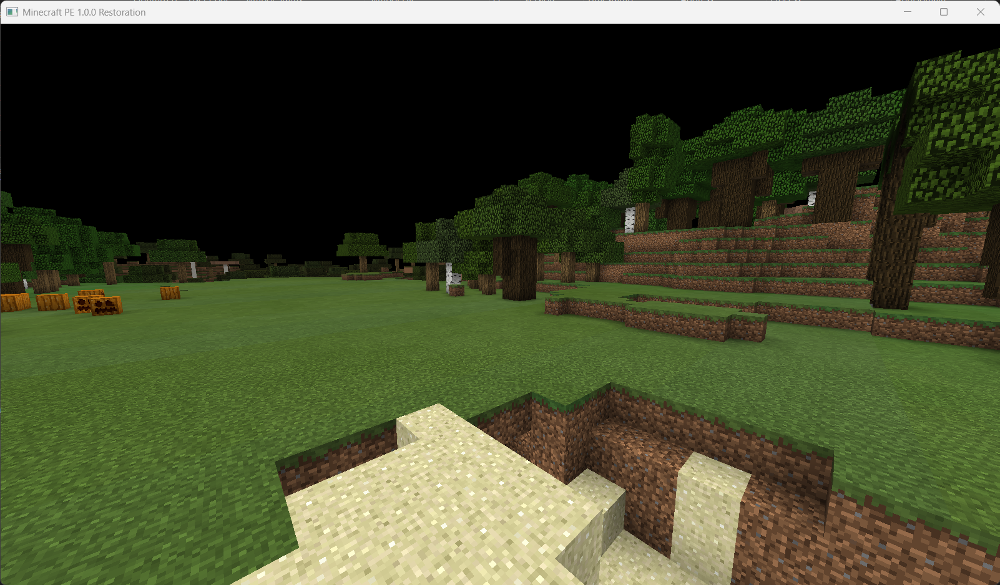
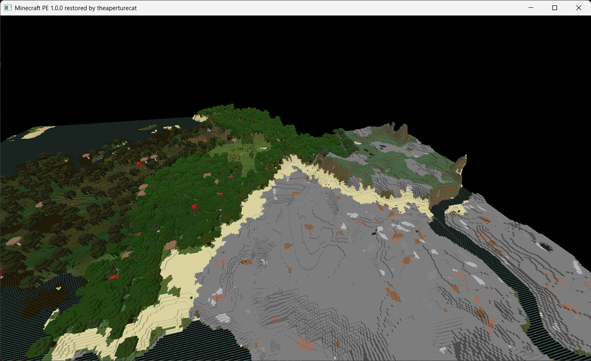
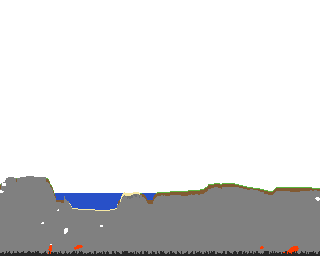
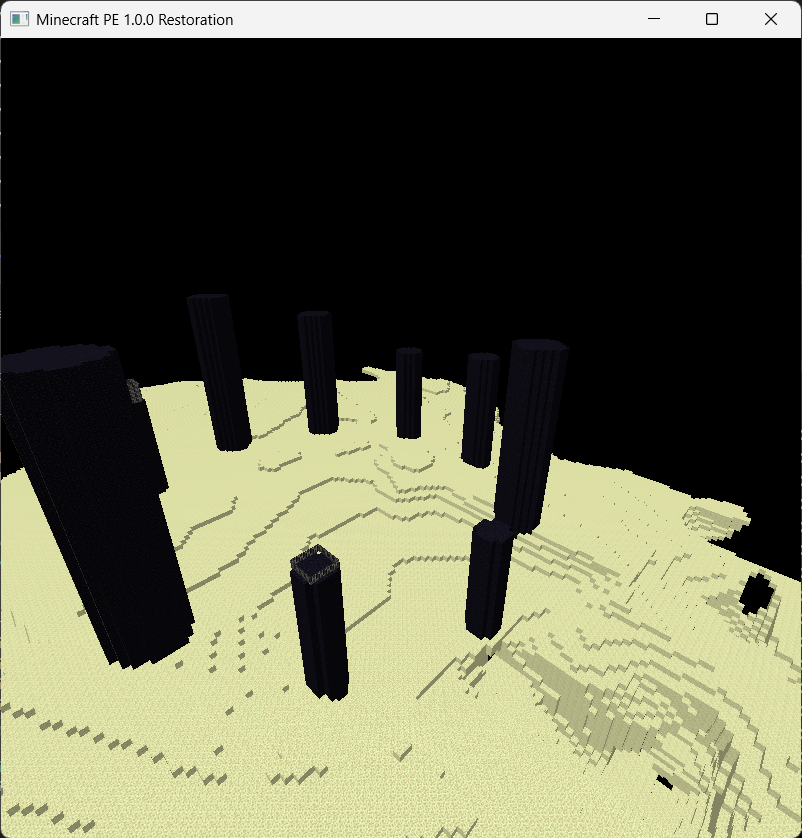

# Minecraft Pocket Edition 1.0.2.0 Code Restoration

This project aims to restore leaked MCPE 1.0.2.0 code from Minecraft Dungeons to working condition and to hopefully be playable.

## About the code
On March 1, 2026, a major Minecraft source code leak which included Minecraft Legacy Console edition code, Minecraft Pocket Edition 0.6.1 code and the full Minecraft Dungeons development repo occurred. The Minecraft Dungeons codebase also included part of a newer version of Pocket Edition's codebase 1.0.2.0, dating to around 2016-2017. This code is only partially complete as several necessary parts to run it have been stripped out and replaced with Unreal Engine 4 code.

## What works
- The full chunk generation code
- Exporting areas of the world as pictures
- Basic textured rendering of chunks (can be seen above)
- Transparent water (buggy still)
- Loading real Minecraft PE shaders+materials (incomplete but works)
- Unstable multithreading (define TEST_THREADING when building a vs solution with cmake)

## Missing/Recreated code
- **lib-deps/Renderer**
 Was removed because it conflicted with Unreal's renderer? Model, Shader, material and texture code has been decompiled/recreated to work, but it remains very incomplete.
- **src/platform** 
 Was removed because Unreal had its own platform abstraction? Some parts of this have been restored, though thread pools need work to actually restore them to a state where they can be multi-threaded.
- **src-client** 
 Was removed because Unreal was the launcher now? It is where the new recreated launcher is.
- **network** 
 Was removed because Unreal has its own networking? Not restored at all
- **world/entity** 
 Was mostly removed because they wanted to use Unreal Actors? Not restored at all yet, a lot of this code will be hard to restore too.
- **world/item**
 Unknown
- **world/level/block/entity**
 Was removed because entity code is heavily removed? Not restored
- **Most redstone related code**
 Was removed because redstone was not needed anymore? Not restored
- **A lot more**

## Interesting code
- **src/common/world/level/levelgen/v1/FarlandsFeature.cpp**
Yes, intentional farlands, though this kind is quite different to the Java Farlands. RandomLevelSource mentions it next to something called the 'underworlds', and both are chunk post processing steps.
- **world/level/GameType.h, world/entity/player/Player.h, world/entity/player/Abilities.h and world/entity/player/Player.cpp**
Code from the HoloLens E3 minecraft demo can be found here. There is not much left that has not been removed in this code but the lightning effect appears to be an actual ability, and there were different 'viewer' gamemodes which were used for the HoloLens viewer.

## Contributing
Contributions are welcome. Create a pull request fixing an issue or restoring a feature to the repo. If you are decompiling code try and find an android build near 1.0.2.0 with debug information.

## TODO
- Fix water
- Restore more of Renderer
- Port code from the 0.6.1 leak
- Add a debug menu (ImGui?)
- Reload neighbouring chunks when a new one is generated
- Load structure files
- Linux support
- Tidy up codebase (especially renderer.cpp and main.cpp)
- Fix BlockTextureTessellator (need to call generateUV()?)
- Move some stuff from the client renderer folder back to the renderer library
- Find where the weird banding in the grass colour is coming from
- Check memory is being freed correctly

## How to compile.
1. Place the contents of the assets folder from a Minecraft Pocket Edition 1.0.0 build (from an APK/IPA/APPX etc) inside the data folder, do not overwrite. Please don't use pirated assets, pay for the game. Inside the data folder there should now be a few more folders and files including one called 'resource_packs'.
2. Use build_win32.bat in handheld/src to generate a Visual Studio solution. There is no support for other platforms yet, but you are welcome to add support for your own.
3. Compile that generated solution and launch it, then type 'render' if you want to go straight into the renderer or use the console for running other commands.

## Images

